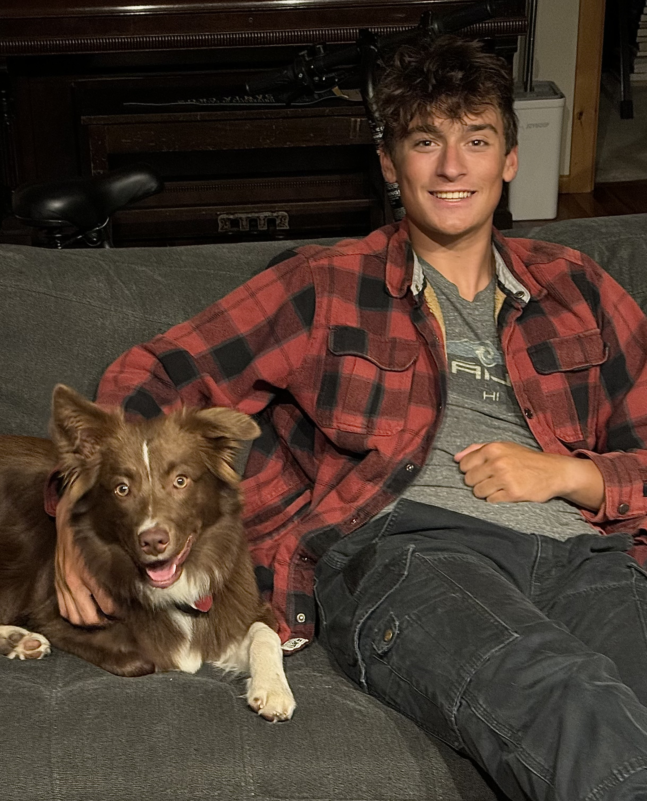

# Hello There! :wave:

## A Little Bit About Me

### My name is Charles Bergenske. I am a student at the University of California, Santa Cruz, pursuing a Robotics Engineering B.S. :robot:

### Some of my interests include:

- Robotics Oriented Computer Vision - Particularly that involving machine learning :desktop_computer: :eye:

- Control Theory - Again, particularly that involving machine learning :chart_with_upwards_trend: :robot:

- Machine Learning (ML) - Who could have guessed? :computer: :brain:

Eventually, I would like to combine these interests, utilizing ML-based computer vision and control theory in composition with other ML tools to build and engineer multimodal, socially-interactive robotics.

### As a robotics engineer, I also hold skills in electrical, mechanical, and computer engineering. To view my full skillset, check out my ***[LinkedIn](https://www.linkedin.com/in/charles-bergenske-1b4123307)***!

## In My Free Time

### I am a big time outdoorsman. When I'm not working on projects, I love being outside and having fun in our beautiful world! :mount_fuji: :sunrise_over_mountains:

### In particular, my biggest hobbies are:

- Downhill mountainbiking :mountain_biking_man:

- Backpacking :hiking_boot: :evergreen_tree:

- Camping :camping:

## If you want/need to contact me, feel free to do so!

### Contact Information:

- Email :envelope:

  cbergens@ucsc.edu

- LinkedIn :link:

  ***[here](https://www.linkedin.com/in/charles-bergenske-1b4123307)***
